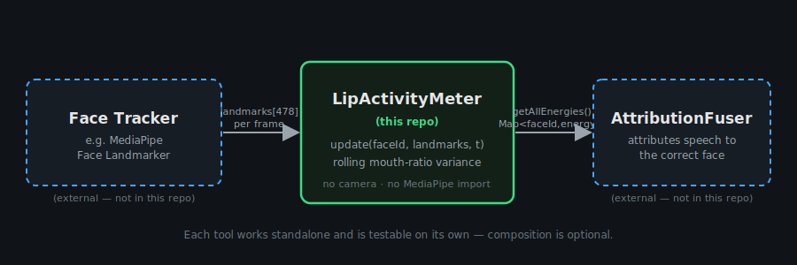
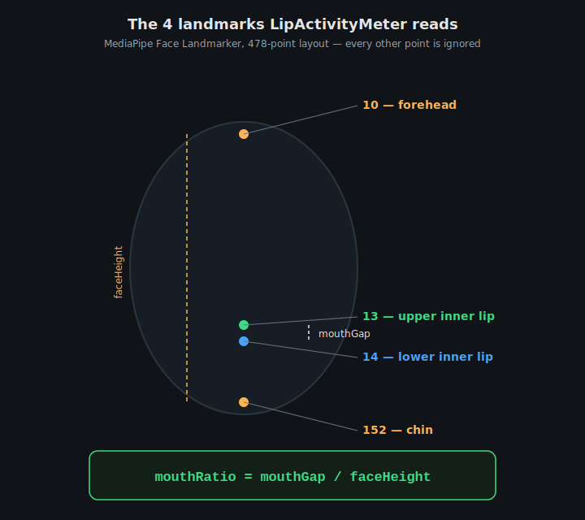
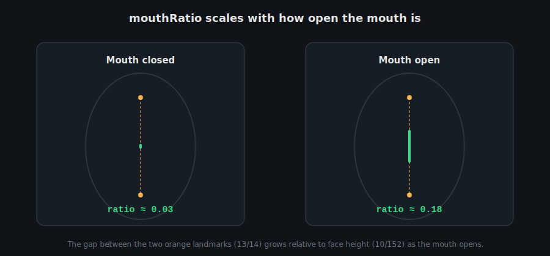
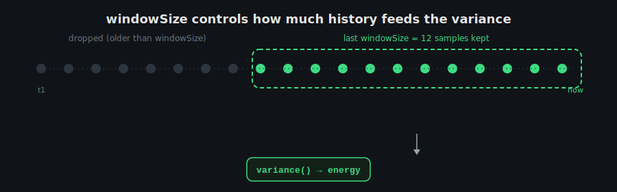
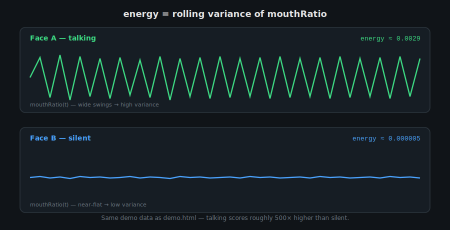
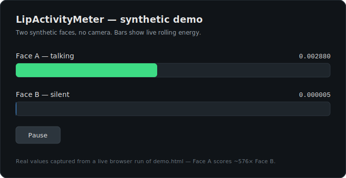
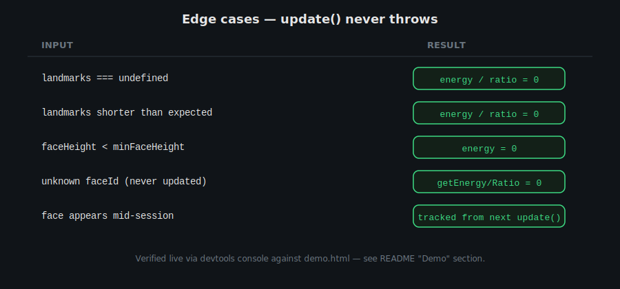

# LipActivityMeter


A standalone, zero-dependency browser tool that turns per-frame face landmark
arrays into a "speaking likelihood" score per face.

It performs **no camera capture and no landmark detection** — it only consumes
landmark arrays that some other tool (a face tracker) provides. This makes it
fully testable on its own with synthetic data, and reusable across projects.



## How it works

Every frame, for each tracked face, the meter computes:

```
mouthRatio = distance(landmark 13, landmark 14) / distance(landmark 10, landmark 152)
```

using the MediaPipe Face Landmarker 478-point layout:

- `13` / `14` — inner upper lip / inner lower lip (the mouth gap)
- `10` / `152` — forehead / chin (used to normalize for face size/distance from camera)

<p align="center">
  
</p>

As the mouth opens, the gap between landmarks 13/14 grows relative to face
height, so `mouthRatio` grows with it:



`energy` is the rolling variance of `mouthRatio` over the last `windowSize`
samples. A silent, closed mouth has a near-constant ratio and low variance; a
talking mouth oscillates and produces much higher variance.





## Install / run

No build step, no npm dependencies. Just serve the directory statically:

```bash
python3 -m http.server 8000
```

Then open `http://localhost:8000/demo.html`.

## API

```js
import { LipActivityMeter } from './lip-activity-meter.js';

const meter = new LipActivityMeter({
  windowSize: 12,      // frames of history for variance
  minFaceHeight: 0.05, // ignore faces smaller than this (normalized units)
});

// Call once per video frame per face.
meter.update(faceId, landmarks, timestampMs);

meter.getEnergy(faceId);      // number — rolling variance of mouth-open ratio
meter.getMouthRatio(faceId);  // number — latest inner-lip gap / face height
meter.getAllEnergies();       // Map<faceId, energy>
meter.prune(olderThanMs);     // drop faces not updated since timestamp
```

### `new LipActivityMeter(options?)`

| Option | Default | Meaning |
| --- | --- | --- |
| `windowSize` | `12` | Number of recent mouth-ratio samples kept per face for the variance calculation. |
| `minFaceHeight` | `0.05` | Faces whose forehead-to-chin distance (normalized) is smaller than this report energy `0`. |

### `update(faceId, landmarks, timestampMs)`

Records one frame of landmark data for `faceId`. Never throws:

- Unknown/new `faceId` — starts tracking it.
- `landmarks` undefined, not an array, or missing the four required points — resets that face's ratio/energy to `0` for this frame.
- Any required landmark with a non-finite (`NaN`/`Infinity`) coordinate — treated as missing, so one tracking glitch can't poison the rolling window with `NaN` energy.
- Face height below `minFaceHeight` (or zero) — energy reported as `0`.

### `getEnergy(faceId)` / `getMouthRatio(faceId)`

Return `0` for any `faceId` that has never been passed to `update()`.

### `getAllEnergies()`

Returns a `Map<faceId, energy>` snapshot for every currently tracked face.

### `prune(olderThanMs)`

Drops any tracked face whose last `update()` call was before `olderThanMs` —
useful for forgetting faces that left the frame.

### `reset()`

Forgets every tracked face at once, e.g. when the camera session restarts.

## Demo

`demo.html` feeds two synthetic landmark streams (no camera):

- **Face A ("talking")** — mouth ratio driven by a sine wave + noise, simulating speech.
- **Face B ("silent")** — mouth ratio with tiny random jitter only.

Two live bars render at ~30fps showing each face's energy; Face A's bar
dominates Face B's by well over 10x. A pause/resume button freezes both
streams. This demo doubles as the visual sanity test for the scorer.

<p align="center">
  
</p>

To manually verify the edge-case handling, open the browser devtools console
on the demo page (the meter instance is exposed as `window.meter`) and try:

```js
meter.update('A', undefined, performance.now());
meter.getEnergy('A'); // 0, no throw
```



## Composes with

- A **face tracker** (e.g. MediaPipe Face Landmarker) — provides the
  per-frame `landmarks` array this tool consumes.
- **AttributionFuser** — consumes `meter.getAllEnergies()` to attribute
  detected speech to the correct on-screen face.

## Tests

```bash
node --test
```

Zero DOM/network dependency end to end, so the suite drives the real
public API directly with synthetic landmark data: ratio math, the
never-throws contract on malformed input, the small-face cutoff,
`windowSize` rolling-history truncation, `prune()`, and an end-to-end
"talking vs. silent" energy comparison matching the demo's own sanity
check. No dependencies to install; Node's built-in test runner is enough.
